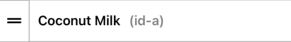

# react-native-drag-and-order

This module takes a list of items and will display them in a scrollview.  The user will be able to reorder the list of items via Drag and Drop using a handle. 

Here is an example.

 

## Installation

```bash
$ yarn add @markmccoid/react-native-drag-and-order
# Other dependancies
$ yarn add moti react-native-reanimated@^2.2.0 react-native-gesture-handler
```

## Usage

The usage is to simply pass you items to be sorted as children to the **DragDropEntry** component. The children you will be passing should be components that:

1. Have an **id** prop. **This is important
2. Have a height that MATCHES the **itemHeight** props value provided to the **DragDropEntry** components itemHeight prop.

> NOTE: A prop called **isMoving** will be injected into each child item.  You can use this prop to change behavior when the item is moving versus not.  This would be useful if you wanted to change the appearance of an item when it is being moved.
> `backgroundColor: isMoving ? 'red' : 'white'`

Here is an example of using the component.

The **DragDropEntry** component is the parent component that wraps the children **Items** that you want to be able to drag and drop.  You can create your own Item component for the children or use the provided **DragItem** component to wrap the values you want to be able to order.

There is a helper function, **sortArray**, that is very useful in reordering and resetting any position/index field in your list.  This helper function is essential when you want to persist the order of your items to your state.

```jsx
import DragDropEntry, { DragItem, sortArray, TScrollFunctions } from "react-native-drag-and-order";

const items = itemList: [
    { id: "a", name: "Coconut Milk", pos: 0 },
    { id: "b", name: "Lettuce", pos: 1 },
    { id: "c", name: "Walnuts", pos: 2 },
    { id: "d", name: "Chips", pos: 3 },
    { id: "e", name: "Ice Cream", pos: 4 },
    { id: "f", name: "Carrots", pos: 5 },
    { id: "g", name: "Onions", pos: 6 },
    { id: "h", name: "Cheese", pos: 7 },
    { id: "i", name: "Frozen Dinners", pos: 8 },
    { id: "j", name: "Yogurt", pos: 9 },
    { id: "k", name: "Kombucha", pos: 10 },
    { id: "l", name: "Lemons", pos: 11 },
    { id: "m", name: "Bread", pos: 12 },
  ];
... 

<DragDropEntry
  scrollStyles={{ width: "100%", height: "30%", borderWidth: 1, borderColor: "#aaa" }}
  updatePositions={(positions) =>
        updateItemList(sortArray<ItemType>(positions, items, "pos"))
    }
  getScrollFunctions={(functionObj) => setScrollFunctions(functionObj)}
  itemHeight={50}
  handlePosition="left"
  handle={AltHandle} // This is optional.  leave out if you want the default handle
  enableDragIndicator={true}
>
  {items.map((item, idx) => {
      return (
        <DragItem
          key={item.id}
          name={item.name}
          id={item.id}
          onRemoveItem={() => removeItemById(item.id)}
          firstItem={idx === 0 ? true : false}
        />
      );
    })}
</DragDropEntry>
```

## DragDropEntry Props

It is helpful to see what parts make up the DragDropEntry component.  Here is a visual. 


- **itemHeight** - *Required* - The height of the items that are returned as children of this component.  Needed so that we can calculate where each item should be positions.

- **updatePositions** - *Required* - function that will run after drop that will reorder/update positions.  It will be passed the positions array of objects, which you can use to reorder your array OR. you can use the [**sortArray** helper function. ](#sortarray-helper-function-usage)

  ```javascript
  positions = {
    id1: 3,
    id2: 1,
    id3: 2,
    id4: 0
  }
  ```

- [**handle** - *Optional* - React component to be used for handle.  A default is provided. If you provide your own Handle component, take a look at **Handle.tsx** for an example. 
  

- **handlePosition** - *Optional* - **default is 'left'** - either 'left' or 'right'.  Positions the handle component on the left or right of each Item component.

- **enableDragIndicator** - *Optional* - **default is 'false'** - Boolean that turns the drag indicator on or off.  The position of the indicator is decided by the handle position.  It will be *opposite* what the handlePosition is.

- **dragIndicator** - *Optional* - React component to be used for drag indicator. The component used will be passed the following props:

  ```jsx
  <DragIndicator
    itemHeight={itemHeight}
    fromLeftOrRight="left" // Or right depending on the handlePosition. This is opposite of the handle position
    currentPosition={movingPos}
    totalItems={numberOfItems}
    config={dragIndicatorConfig}
  />
  ```

- **dragIndicatorConfig** - *Optional*- common config options passed to the dragIndicator.  By changing the config items, you may not need to create a custom **dragIndicator**

  - **translateXDistance** - How far should the drag indicator travel into the item
    
  - **indicatorBorderWidth**
  - **indicatorBorderColor**
  - **indicatorBackgroundColor**
  - **indicatorBorderRadius**

- **enableHapticFeedback** \- *Optional* - **default is 'false'** -  *boolean* - Enables haptic feedback when moving an item.

- **scrollStyles** - *Optional* - styles that will be spread on ScrollView styles prop.

- **getScrollFunctions** - *Optional* - function that passes scroll function so calling component can scroll list to start or end.

  - Implementation:

  - ```jsx
    const [scrollFunctions, setScrollFunctions] = React.useState<ScrollFunctions>();
    ...
    <DragDropEntry
        getScrollFunctions={(functionObj) => {
          setScrollFunctions(functionObj);
        }}
        ...
    > ... </DragDropEntry>
    ```

  - Now, the **scrollFunctions** variable can call the following:

    **scrollFunctions.scrollToEnd()** or **scrollFunctions.scrollToStart()** or **scrollFunctions.scrollToY(yPos)**

  ##sortArray helper function usage

  The most common use case for Drag to Reorder will involve an array of items that you want to be able to reorder.  To be practical, you will want to update the new sorted array somewhere to persist the state of that array.

  This is what the **updatePositions** property is for.  It accepts a function, which will be called every time your list of items order is changed.  A **positions** object will be passed as the only argument to the function.  You can use this object to sort your own array, or use the sortArray helper function.

  First, the shape of the **positions** object:

  ```typescript
  export type Positions = {
    [key: string]: number;
  };
  
  // the key is the id in your original array, the value is the current position
  // in the scrollview.
  // 
  const positionExample = {
    a: 0,
    c: 3,
    b: 1,
    d: 2
  }
  ```

  **sortArray** accepts the **positions** object, your **item array** and optionally the name of your position field (if you use one).

  Here is an example usage:

  ```tsx
  <DragDropEntry
  	scrollStyles={{ width: "100%", height: "30%", borderWidth: 1, borderColor: "#aaa" }}
  	updatePositions={(positions) =>
  				updateItemList(sortArray<ItemType>(positions, items, "pos"))
  		}
    ...
  >
  	...
  </DragDropEntry>  
  ```

  > NOTE: The sort array will always return the passed items array sorted and if your objects in the array include a *position* property.  This is optional and you do NOT need a position key in your object in the array.

  
